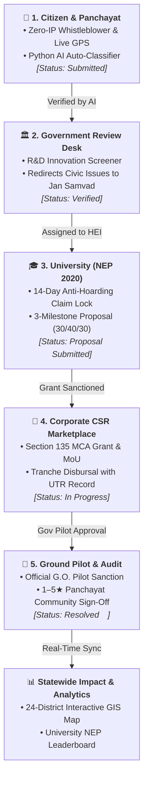

# 🏆 Samadhan-Setu: Live Demonstration & Judge Pitch Guide
**Smart India Hackathon 2026 • Problem Statement ID: SIH26043**  
*Department of Higher & Technical Education, Government of Jharkhand*

---

## 🧭 System Architecture & Port Mapping

| Service | Technology | Port | Purpose / Swagger |
| :--- | :--- | :--- | :--- |
| **Frontend Web App** | Next.js 14 / Tailwind CSS | `3000` | `http://localhost:3000` |
| **Citizen Microservice** | Node.js / Express / TypeScript | `5001` | `http://localhost:5001` |
| **University Microservice** | Node.js / Express / TypeScript | `5002` | `http://localhost:5002` |
| **Industry & CSR Microservice** | Node.js / Express / TypeScript | `5003` | `http://localhost:5003` |
| **Government Analytics Microservice** | Node.js / Express / TypeScript | `5004` | `http://localhost:5004` |
| **AI Problem Intelligence Engine** | Python / FastAPI / Gemini 1.5 | `5005` | `http://localhost:5005/docs` |

---

## ⚡ Quick Port Checklist & Startup Commands

To ensure all functionalities, AI auto-detection, and multi-portal databases work smoothly during the demo, run these services in separate terminal windows:

| Terminal | Service | Port | Terminal Startup Command |
| :--- | :--- | :--- | :--- |
| **Terminal 1** | **Python AI Engine** | `5005` | `cd Backend/ai` <br/> `python -m uvicorn main:app --port 5005 --reload` |
| **Terminal 2** | **Citizen API** | `5001` | `cd Backend` <br/> `npx ts-node citizen/server.ts` |
| **Terminal 3** | **University API** | `5002` | `cd Backend` <br/> `npx ts-node university/server.ts` |
| **Terminal 4** | **Industry CSR API** | `5003` | `cd Backend` <br/> `npx ts-node industry/server.ts` |
| **Terminal 5** | **Government API** | `5004` | `cd Backend` <br/> `npx ts-node gov/server.ts` |
| **Terminal 6** | **Next.js Frontend** | `3000` | `cd Frontend` <br/> `npm run dev` |

---

## ⚠️ Pre-Demo Precautions & Best Practices

1. **MongoDB Running:** Ensure MongoDB is running locally on port `27017` (or your MongoDB Atlas connection string is configured in `.env`).
2. **One-Time Database Seeding:** Before starting your presentation, run the seed script to reset clean demo data across all 24 districts:
   ```powershell
   cd Backend
   npx ts-node seedData.ts
   ```
3. **Check Environment Variables:**
   * `Backend/.env` should contain:
     ```env
     MONGODB_URI=mongodb://localhost:27017/samadhan_setu
     JWT_SECRET=samadhan_setu_jwt_secret_2026
     AI_SERVICE_URL=http://localhost:5005/api/ai
     ```
   * `Frontend/.env.local` should point to ports `5001`, `5002`, `5003`, `5004`, `5005`.
4. **Cloudinary Uploads:** If demonstrating photo evidence upload, ensure your Cloudinary upload preset is set to **`Unsigned`**. If unconfigured, the system automatically falls back to secure local previews with zero crashes.
5. **AI Fallback Safety:** If `GEMINI_API_KEY` is not provided in `Backend/ai/.env`, the AI service will seamlessly and automatically use its built-in rule-based classification engine without throwing errors.
6. **Pre-Open Browser Tabs:** For a seamless pitch, open these tabs in advance:
   * Tab 1: `http://localhost:3000` (Main Landing Page)
   * Tab 2: `http://localhost:3000/citizen` (Citizen & Whistleblower Hub)
   * Tab 3: `http://localhost:3000/gov` (Statewide 24-District Command Center)
   * Tab 4: `http://localhost:5005/docs` (FastAPI Swagger Interactive Docs)

---

## 🔑 Pre-Seeded Test Credentials Cheatsheet

| Role | Identifier / Email | Password | Pre-Seeded Entity |
| :--- | :--- | :--- | :--- |
| **🌾 Citizen / Panchayat** | `9876543210` | `Citizen@1234` | Ramesh Munda (Sukhurhutu Panchayat, Ranchi) |
| **🎓 University Mentor** | `ananya.sen@bitmesra.ac.in` | `Univ@1234` | Dr. Ananya Sen (BIT Mesra, Ranchi) |
| **🎓 University Mentor 2** | `prof.sharma@iitism.ac.in` | `Univ@1234` | Prof. Vivek Sharma (IIT ISM Dhanbad) |
| **🏢 Corporate CSR Partner** | `csr.jharkhand@tatasteel.com` | `Industry@1234` | Tata Steel CSR Foundation, Jamshedpur |
| **🏛️ State Government Admin** | `director.higheredu@jharkhand.gov.in` | `GovAdmin@1234` | Rajesh Kumar Singh (IAS), Higher Edu Dept |
| **🛡️ Whistleblower Passkeys** | `ANON-JH-W7892X` (Water) & `ANON-JH-B1042K` (Bokaro Chemical) | *No password needed* | Zero-login private tracking timeline |

---

## 🔄 End-to-End Inter-Authority Complaint Lifecycle & Flow Diagram

The complete journey of a crowdsourced challenge across all 4 stakeholders (Citizens, Government, Universities, Industry CSR) with the specific features active at each step:

```mermaid
flowchart TD
    subgraph CITIZEN["🌾 STAGE 1: CITIZEN & PANCHAYAT REPORTING"]
        C1["Citizen / Whistleblower Accesses Portal"] --> C2["Fill Problem Title & Description (Bilingual)"]
        C2 --> C3["AI Live Auto-Classification Engine (Port 5005)"]
        C3 --> C4["Optional: Live GPS Coordinates + Check on Map"]
        C4 --> C5["Photo Upload with Client-Side EXIF Stripper"]
        C5 --> C6["Submit Problem (Auth / Anon Passkey Generated)"]
    end

    C6 -->|"Status: 'Submitted'"| GOV_SCREEN

    subgraph GOV["🏛️ STAGE 2: GOVERNMENT REVIEW & ALLOCATION"]
        GOV_SCREEN{"R&D Innovation vs Routine Complaint?"}
        GOV_SCREEN -->|"Routine Grievance (Left)"| JAN_SAMVAD["Handover to Official Jharkhand CM Jan Samvad Portal"]
        GOV_SCREEN -->|"Actionable R&D (Center)"| HEI_ROUTE["Validate & Route to Recommended HEI (BIT Mesra / IIT ISM)"]
        GOV_SCREEN -->|"Disaster SOS (Right)"| SOS_ALERT["Priority Fast-Track to DDMA Emergency Queue"]
    end

    HEI_ROUTE -->|"Status: 'Verified'"| UNIV_STAGE

    subgraph UNIV["🎓 STAGE 3: UNIVERSITY INNOVATION (NEP 2020)"]
        UNIV_STAGE["University R&D Portal (Port 5002)"] --> U1["14-Day Claim Expiry Lock (Anti-Hoarding)"]
        U1 --> U2["Form Multidisciplinary Student Team + Faculty Mentor"]
        U2 --> U3["Submit 3-Stage Milestone Proposal (30/40/30)"]
        U3 --> U4["Declare Open Source / Social Good IP Ownership"]
        U4 --> U5["Issue Institutional Endorsement Letter (Form NEP-2020-R&D)"]
    end

    U5 -->|"Status: 'Proposal Submitted'"| CSR_STAGE

    subgraph CSR["🏢 STAGE 4: INDUSTRY CSR GRANT MARKETPLACE"]
        CSR_STAGE["CSR Foundations Portal (Port 5003)"] --> I1["Discover Vetted Student R&D Proposals"]
        I1 --> I2["Pledge Milestone CSR Grant (Sec 135 Compliant)"]
        I2 --> I3["Issue Form CSR-1 Grant Award Letter & MoU"]
        I3 --> I4["Disburse Tranche 1 with UTR Ledger Tracking"]
        I4 --> I5["Direct Technical Mentorship Channel with Students"]
    end

    I5 -->|"Status: 'In Progress'"| FIELD_PILOT

    subgraph PILOT["🚜 STAGE 5: FIELD PILOT, TESTING & RESOLUTION"]
        FIELD_PILOT["Gov Review Desk (Port 5004)"] --> P1["Issue Official Government Order (G.O.) Pilot Sanction"]
        P1 --> P2["Student Team Deploys Physical Prototype in Village"]
        P2 --> P3["Ground Testing & Community Water / Soil Verification"]
        P3 --> P4["Citizen / Panchayat Ground Verification (1-5★ Rating)"]
        P4 --> P5["Issue Gram Panchayat Completion & Social Audit Certificate"]
    end

    P5 -->|"Status: 'Resolved' 🎉"| COMPLETED["Statewide 24-District Analytics & Heatmap Updated"]
```



---

### 📋 Complete Step-by-Step Feature Matrix & Authority Handover:

| Stage & Stakeholder | Portal Route & Port | Trigger Action | Database Status | Key Active Features at this Step | Official Document Generated |
| :--- | :--- | :--- | :--- | :--- | :--- |
| **Stage 1: Citizen / Whistleblower** | `/citizen/submit`<br>*(Port 3000 $\rightarrow$ 5001)* | Fills form + Clicks *"Submit Societal Challenge"* | `Submitted` | • 🛡️ Zero IP/Phone logging (Whistleblower Protection)<br>• 📷 Client-side canvas EXIF metadata stripper<br>• 📍 Live GPS Coordinates + *"🗺️ Check on Map"*<br>• 🤖 Python FastAPI live domain & severity classifier<br>• 🔑 Anonymous Passkey generator (`ANON-JH-XXXXXX`) | Anonymous Tracking Passkey |
| **Stage 2: Government Review Desk** | `/gov/verify`<br>*(Port 3000 $\rightarrow$ 5004)* | Clicks *"Validate & Assign HEI"* OR *"Jan Samvad"* | `Verified`<br>*(or `Rejected`)* | • 🚨 Disaster Emergency SOS Fast-Track Queue<br>• 🔬 AI R&D Feasibility Screener<br>• 🏛️ 1-Click Redirect to official `cm-jansamvad.jharkhand.gov.in`<br>• 🎓 Geospatial HEI Distance & Expertise Routing | Official Administrative Handover |
| **Stage 3: University Innovation Team** | `/university`<br>`/university/proposals`<br>*(Port 3000 $\rightarrow$ 5002)* | Clicks *"Claim Challenge (14-Day Lock)"* $\rightarrow$ *"Submit Proposal"* | `Assigned to University`<br>$\rightarrow$ `Proposal Submitted` | • ⏳ 14-Day Anti-Hoarding Claim Expiry Lock<br>• 👥 Multidisciplinary Student Team Formulation<br>• 📋 3-Stage Milestone Budget Builder (30/40/30)<br>• 🌐 Open Source / Social Good IP Declaration<br>• 📤 Milestone Deliverable & Prototype Uploader | 📄 **Institutional R&D Endorsement Letter (Form NEP-2020-R&D)** with Dean Seal |
| **Stage 4: Corporate CSR Foundation** | `/industry`<br>`/industry/collaborations`<br>*(Port 3000 $\rightarrow$ 5003)* | Clicks *"Pledge CSR Grant & Mentorship"* $\rightarrow$ *"Disburse Tranche"* | `In Progress` | • 🏢 CSR Proposal Discovery & Thematic Filtering<br>• 💰 Milestone-Linked Tranche Grants (Sec 135)<br>• 💳 Electronic Fund Transfer & UTR Ledger Record<br>• 💬 Direct Technical Mentorship Chat Channel | 📄 **Form CSR-1 Grant Award Letter & Section 135 MCA MoU** |
| **Stage 5a: Government Field Clearance** | `/gov/verify`<br>*(Port 3000 $\rightarrow$ 5004)* | Clicks *"Authorize Field Pilot Sanction"* | `Testing` | • 📋 Formal Administrative Pilot Deployment Order<br>• 🏛️ District Collector & BDO Logistical Directives<br>• 🗺️ 24-District Real-Time Heatmap Sync | 📄 **Official Government Order (G.O.) Memo (`JH/DHTE/2026/SANCTION-XXXX`)** |
| **Stage 5b: Citizen Ground Verification** | `/citizen/my-problems`<br>*(Port 3000 $\rightarrow$ 5001)* | Enters passkey + Clicks *"Confirm Resolution (1-5★)"* | `Resolved` 🎉 | • 🔑 Zero-login Anonymous Passkey Status Lookup<br>• ⏱️ Interactive 6-Stage Visual Timeline<br>• ⭐ Mandatory 1–5 Star Community Ground Sign-Off<br>• 📊 Statewide KPI & University Leaderboard Update | 📄 **Gram Panchayat Ground Completion & Social Audit Certificate** |

---

## 📊 ⚡ Compact Lifecycle Flowchart (Optimized for PPT Presentation Slides)

> **💡 Copy & Paste into PPT / Canva Slide:** This compact diagram summarizes the entire 5-stage Quadruple Helix lifecycle in a clean vertical (Top-to-Bottom) flow:



### 🎯 5-Bullet PPT Pitch Summary:
1. **🌾 Grassroots Sourcing:** Rural citizens/whistleblowers report problems with zero IP logging, EXIF stripper, GPS check, & Python AI classification (`Submitted`).
2. **🏛️ Government Screening:** State officers filter routine civic issues to **Jan Samvad** and assign high-impact R&D challenges to HEIs (`Verified`).
3. **🎓 NEP 2020 Academic Hub:** Universities claim problems under a **14-day lock**, form multidisciplinary student teams, & submit 3-stage milestone proposals (`Proposal Submitted`).
4. **🏢 Corporate CSR Marketplace:** Industry sponsors pledge **Section 135 grants**, disburse tranches with UTR tracking, & provide technical mentorship (`In Progress`).
5. **🚜 Field Pilot & Citizen Sign-off:** Government sanctions deployment (`Testing`), students install solutions, & local Panchayats verify with a **1–5★ rating** (`Resolved`).

---

## 🎬 5-Step Hackathon Demonstration Script

### 📍 Step 1: Citizen Experience & 🛡️ Whistleblower Protection
1. Navigate to **`http://localhost:3000/citizen`** to view the live crowdsourced problem feed with community upvoting.
2. Click **"Report a Problem"** (`/citizen/submit`).
3. Toggle **"🛡️ Submit Anonymously (Whistleblower Mode)"**:
   * *Highlight to Judges:* Point out that IP addresses and phone numbers are completely zero-logged, and client-side photo EXIF metadata is stripped to protect rural citizens reporting illegal mining or industrial pollution.
4. **Copy & Paste any of these 10 Ready-to-Use Demo Problems (English & Hindi):**

   * **🌿 Demo Problem 1 (Water Resources - Whistleblower Mode | Ranchi):**
     * **Title:** `Severe Fluoride and Arsenic Contamination in Rural Drinking Wells`
     * **Hindi Title:** `ग्रामीण पेयजल कुओं में अत्यधिक फ्लोराइड और आर्सेनिक का प्रदूषण`
     * **Description:** `Over 8 villages in Kanke block reporting dental and skeletal fluorosis among school children due to high fluoride levels (6.8 ppm vs 1.5 ppm safe limit) in deep borewells. Need solar-powered electro-coagulation or low-cost filtration unit for the community.`
     * **Hindi Description:** `कांके प्रखंड के 8 गांवों में बच्चों के दांत पीले और हड्डियां कमजोर हो रही हैं। पानी में 6.8 ppm फ्लोराइड है। कृपया सौर ऊर्जा से चलने वाले वाटर फिल्टर तकनीक से समाधान निकालें।`
     * **District:** `Ranchi` | **Block:** `Kanke` | **Village:** `Sukhurhutu Panchayat` | **Landmark:** `Near Govt Middle School Well`
     * **Expected AI Auto-Detect:** `Water Resources` • `High Severity` • `Actionable R&D: Yes`

   * **🌾 Demo Problem 2 (Agriculture & Tribal Post-Harvest | Khunti):**
     * **Title:** `High Post-Harvest Paddy Spoilage and Aflatoxin Fungal Contamination`
     * **Hindi Title:** `कटाई के बाद धान का भारी नुकसान और फफूंद संक्रमण`
     * **Description:** `Tribal farmers suffering 35% crop loss in storage due to high humidity and lack of portable moisture testing. Requesting low-cost IoT capacitive moisture sensor and solar drying cabinet for Mahila Samitis.`
     * **Hindi Description:** `खूंटी के मुरहू में नमी और धूप न मिलने से धान में फंगस लग जाता है और 35% फसल सड़ जाती है। महिला स्वयं सहायता समूहों के लिए सौर सुखाने वाले चैंबर और सेंसर की आवश्यकता है।`
     * **District:** `Khunti` | **Block:** `Murhu` | **Village:** `Torpa Gram` | **Landmark:** `Near Krishi Sahayata Kendra`
     * **Expected AI Auto-Detect:** `Agriculture` • `Medium Severity` • `Actionable R&D: Yes`

   * **🚨 Demo Problem 3 (Disaster Management - Fast-Track SOS Alert | Dhanbad):**
     * **Title:** `Toxic Carbon Monoxide Leak & Subterranean Coal Fire Subsidence`
     * **Hindi Title:** `भूमिगत कोयला खदान से जहरीली कार्बन मोनोऑक्साइड गैस का रिसाव`
     * **Description:** `Underground mine fire breakout near Jharia settlement causing sudden ground fissures and toxic carbon monoxide blowout. Immediate structural evacuation and rapid sensor deployment needed.`
     * **Hindi Description:** `झरिया में जमीन फटने से जहरीली गैस निकल रही है जिससे बस्ती के 500 घरों में सांस लेना मुश्किल हो गया है। तत्काल आपातकालीन सेंसर और बचाव की जरूरत है।`
     * **District:** `Dhanbad` | **Block:** `Jharia` | **Village:** `Bhowra Colliery Ward 4` | **Landmark:** `Near Mining Gate 3`
     * **Expected AI Auto-Detect:** `Disaster Management` • `Critical Severity` • `🚨 Emergency SOS Fast-Track`

   * **🏥 Demo Problem 4 (Healthcare & Remote Diagnostics | West Singhbhum):**
     * **Title:** `Non-Invasive Severe Anemia & Sickle Cell Screening Device for Tribal Mothers`
     * **Hindi Title:** `आदिवासी माताओं के लिए गैर-आक्रामक एनीमिया और सिकल सेल स्क्रीनिंग उपकरण`
     * **Description:** `Over 60% of pregnant tribal women in remote forested blocks suffer from acute anemia without access to pathology labs. Requesting a battery-operated non-invasive spectroscopic hemoglobin monitor for Anganwadi workers.`
     * **Hindi Description:** `दूरदराज के जंगली क्षेत्रों में गर्भवती महिलाओं में गंभीर खून की कमी है। बिना सुई चुभाए काम करने वाले पोर्टेबल हीमोग्लोबिन जांच उपकरण की मांग है।`
     * **District:** `West Singhbhum` | **Block:** `Chaibasa` | **Village:** `Jhinkpani Panchayat` | **Landmark:** `Anganwadi Center 2`
     * **Expected AI Auto-Detect:** `Healthcare` • `High Severity` • `Actionable R&D: Yes`

   * **⚡ Demo Problem 5 (Clean Energy & Micro-Grids | Gumla):**
     * **Title:** `Off-Grid Solar Micro-Grid and Compact Grain Milling Unit`
     * **Hindi Title:** `ऑफ-ग्रिड सोलर माइक्रो-ग्रिड और मिनी अनाज पिसाई चक्की`
     * **Description:** `Un-electrified hill village faces 8km travel for manual diesel milling. Need decentralized 5kW solar PV micro-grid with DC micro-milling machine operated by self-help groups.`
     * **Hindi Description:** `गुमला के पहाड़ी गांव में बिजली न होने से महिलाओं को 8 किमी दूर डीजल चक्की जाना पड़ता है। 5kW सौर ऊर्जा चालित मिनी चक्की की आवश्यकता है।`
     * **District:** `Gumla` | **Block:** `Raidih` | **Village:** `Kochedega Panchayat` | **Landmark:** `SHG Community Center`
     * **Expected AI Auto-Detect:** `Energy` • `Medium Severity` • `Actionable R&D: Yes`

   * **🏭 Demo Problem 6 (Environment - Whistleblower Mode | Bokaro):**
     * **Title:** `Untreated Heavy Metal Chemical Effluent Discharge into Garga River Basin`
     * **Hindi Title:** `गरगा नदी में बिना उपचारित रासायनिक जहरीले कचरे का बहाव`
     * **Description:** `Dark acidic industrial effluent being released into Garga river culvert late night, turning water black and wiping out aquatic life. Need automated IoT water pH/turbidity monitoring probe with tamper-proof cloud alerts.`
     * **Hindi Description:** `बोकारो के चास में रात के समय औद्योगिक कारखानों का काला जहरीला पानी नदी में बहाया जा रहा है। नदी का पानी जहरीला हो गया है। स्वचालित प्रदूषण मॉनिटरिंग की जरूरत है।`
     * **District:** `Bokaro` | **Block:** `Chas` | **Village:** `Kandra Industrial Area` | **Landmark:** `Garga River Bridge Culvert`
     * **Expected AI Auto-Detect:** `Environment` • `High Severity` • `Actionable R&D: Yes`

   * **📚 Demo Problem 7 (Education & Rural EdTech | Simdega):**
     * **Title:** `Offline Solar-Powered Mesh Intranet Learning Pod for Forest Schools`
     * **Hindi Title:** `जंगल के स्कूलों के लिए सौर-ऊर्जा संचालित ऑफलाइन डिजिटल लर्निंग पॉड`
     * **Description:** `Zero cellular and broadband internet connectivity in dense forest tribal primary school. Requesting offline localized Raspberry Pi Wi-Fi mesh intranet server with preloaded NCERT tribal language modules powered by a mini solar panel.`
     * **Hindi Description:** `सिमडेगा के घने जंगल में स्थित प्राथमिक विद्यालय में इंटरनेट नहीं है। सौर ऊर्जा से चलने वाले ऑफलाइन लोकल सर्वर की मांग है ताकि बच्चे डिजिटल पढ़ाई कर सकें।`
     * **District:** `Simdega` | **Block:** `Kolebira` | **Village:** `Tangar Panchayat` | **Landmark:** `Forest Primary School`
     * **Expected AI Auto-Detect:** `Education` • `Medium Severity` • `Actionable R&D: Yes`

   * **♻️ Demo Problem 8 (Waste Management & Geopolymers | East Singhbhum):**
     * **Title:** `Upcycling Blast Furnace Slag Waste into Permeable Geopolymer Paving Bricks`
     * **Hindi Title:** `कारखाने के धातु कचरे (स्लैग) से पानी सोखने वाली पेवर ईंटों का निर्माण`
     * **Description:** `Massive accumulation of granulated blast furnace slag creating environmental particulate hazard. Proposing formulation of alkali-activated geopolymer interlocking tiles that allow rainwater percolation and reduce landfill burden.`
     * **Hindi Description:** `जमशेदपुर के आसपास कारखानों के स्लैग कचरे से प्रदूषण हो रहा है। इस कचरे से मजबूत और वर्षा जल सोखने वाली ईंटें बनाने के लिए तकनीकी शोध की आवश्यकता है।`
     * **District:** `East Singhbhum` | **Block:** `Golmuri-cum-Jugsalai` | **Village:** `Bistupur Outer Sector` | **Landmark:** `Industrial Waste Yard Gate`
     * **Expected AI Auto-Detect:** `Waste Management` • `Medium Severity` • `Actionable R&D: Yes`

   * **💧 Demo Problem 9 (Smart Irrigation & Drought Resilience | Palamu):**
     * **Title:** `Automated Solar Low-Pressure Drip Kit for Hillside Tribal Cultivation`
     * **Hindi Title:** `पलामू के सूखाग्रस्त क्षेत्रों के लिए स्वचालित सौर ड्रिप सिंचाई प्रणाली`
     * **Description:** `Chronic severe groundwater depletion in Palamu leading to seasonal migration. Requesting gravity-fed soil moisture-automated solar drip irrigation system saving 70% water for pulse and vegetable crops.`
     * **Hindi Description:** `पलामू के सूखाग्रस्त इलाके में पानी की भारी कमी है। मिट्टी की नमी सेंसर से अपने आप चालू होने वाली सस्ती सौर ड्रिप सिंचाई किट की जरूरत है।`
     * **District:** `Palamu` | **Block:** `Medininagar` | **Village:** `Chhatarpur Agro Hub` | **Landmark:** `Kisan Demonstration Field`
     * **Expected AI Auto-Detect:** `Water Resources` • `High Severity` • `Actionable R&D: Yes`

   * **📋 Demo Problem 10 (Jan Samvad Redirection Test Case - Municipal):**
     * **Title:** `Broken street light and single pothole on market road`
     * **Hindi Title:** `बाजार की सड़क पर स्ट्रीट लाइट खराब और छोटा गड्ढा`
     * **Description:** `The municipal bulb near the vegetable market has stopped working for 2 days. Please send an electrician to replace the bulb.`
     * **Hindi Description:** `सब्जी मंडी के पास नगर निगम का खंभा नंबर 4 की लाइट खराब हो गई है। कृपया लाइनमैन भेजकर ठीक कराएं।`
     * **District:** `Hazaribagh` | **Block:** `Sadar` | **Village:** `Ward 7` | **Landmark:** `Near Daily Market`
     * **Expected AI Auto-Detect:** `Urban Development` • `Low Severity` • `Actionable R&D: False (Redirect to Jan Samvad)`

5. Click **"Attach Photo Evidence"** to demonstrate the direct file picker and canvas EXIF stripper.
6. Click **"AI Auto-Detect Category"** button to show the Python AI engine automatically extracting the domain, severity, and tags.
7. Click **"Submit Societal Challenge to Innovation Grid"**:
   * Show the popup **Secret Passkey Modal** (e.g. `ANON-JH-W7892X`) and click **"Copy Key"**.
8. Navigate to **"Track Secret Passkey"** (`/citizen/my-problems?passkey=ANON-JH-W7892X`) to show the real-time 6-stage visual timeline without requiring any login!

---

### 📍 Step 2: Government Review Desk & Validation
1. Go to **`http://localhost:3000/gov/verify`**.
2. Find the newly submitted problem in the **Incoming Challenges Verification Queue**.
3. Click **"Validate & Assign HEI"**:
   * The challenge is validated as an authentic Academic R&D problem, and its status updates to **`Verified`**.
4. *(Optional Jan Samvad Demo)*: For municipal issues (like Problem 10), click **"Jan Samvad"** to redirect routine complaints directly to the Jharkhand Jan Samvad portal (`https://jansamvad.jharkhand.gov.in`).

---

### 📍 Step 3: University Hub & 14-Day Claim Locking (NEP 2020)
1. Go to **`http://localhost:3000/university`**.
2. Filter by domain or find the verified challenge.
3. Demonstrate the **"Claim Challenge (14-Day Lock)"** button:
   * *Highlight to Judges:* Emphasize that the 14-day lock gives student teams time to formulate multidisciplinary proposals without fear of other teams swooping in, while preventing dead hoarding.
4. Click **"Create Proposal"** to open the **Proposal & Milestone Builder** (`/university/proposals`):
   * Show the 3-stage milestone release schedule (30% Design, 40% Working Prototype, 30% Pilot Deployment).
   * Show the transparent **IP Ownership Declaration** (*Open Source Social Good*).
   * Click **"Submit Solution Proposal"** ➜ Problem status updates to **`Proposal Submitted`**.

---

### 📍 Step 4: Industry & Corporate CSR Grant Marketplace
1. Go to **`http://localhost:3000/industry`**.
2. Browse open university proposals filterable by budget and domain category.
3. Click **"Pledge CSR Grant & Mentorship"**:
   * Enter the pledge amount (e.g. `₹1,50,000`) and confirm.
   * Problem status updates to **`In Progress`**!
4. Navigate to **"My Sponsored Collaborations"** (`/industry/collaborations`):
   * Show the **UTR-verified tranche payment roadmap** (`UTR-TATA-2026-001`).
   * Demonstrate the **Direct Technical Mentorship Chat Thread** where corporate engineers advise students on materials (e.g. *"Use 316L stainless steel electrodes"*).
   * Show the **CSR Social Impact Certificate** downloadable for Section 135 compliance.

---

### 📍 Step 5: Government Pilot Sanction & Citizen Ground Verification
1. Navigate to **`http://localhost:3000/gov`**:
   * **Real-time KPI Counters:** Total challenges reported, active student teams, CSR funds mobilized, and deployed solutions.
   * **24-District Interactive Heatmap:** Click on different districts (*Ranchi, Dhanbad, Bokaro, Khunti, Palamu*) to view localized problem densities.
   * **🚨 Disaster Emergency SOS Alert Queue:** Life-threatening emergencies fast-tracked for immediate DDMA dispatch.
2. In `/gov/verify`, click **"Authorize Field Pilot Sanction"** ➜ Grants sanction order `JH-PILOT-2026-XXXX` and updates status to **`Testing`**.
3. **Closing the Impact Loop:** Return to the Citizen tracker (`/citizen/my-problems?passkey=ANON-JH-W7892X`):
   * The visual timeline shows Stage 5 reached!
   * Click **"Confirm Ground Resolution"** to submit a **5/5 ⭐ Citizen Ground-Truth Rating**, officially locking the problem as **`Resolved`**!

---

## 🏁 Summary of Real-Life Ground Innovations for SIH Jury
1. **Whistleblower Identity Shield:** Zero identity logging + client-side EXIF stripping + secret passkey access.
2. **14-Day Claim Expiry Lock:** Eliminates inactive challenge hoarding across universities.
3. **Milestone-Linked Tranche Grants:** Corporate CSR grants disbursed in 3 stages linked to verified deliverables.
4. **Direct Industry Mentorship Channel:** Corporate R&D scientists mentor student engineering teams directly.
5. **Mandatory Citizen Ground Verification:** 1–5 star community confirmation required before marking challenges solved.
6. **24-District Interactive Heatmap:** Real-time geospatial monitoring across all 24 districts of Jharkhand.


