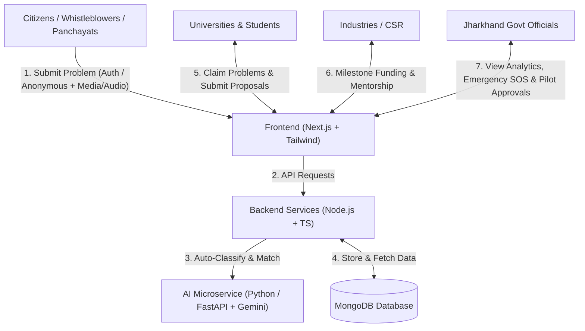
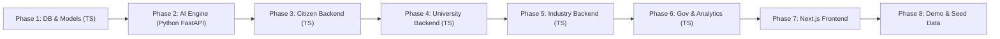

# 🌉 Samadhan-Setu (समाधान सेतु)

**A Digital Platform to Crowdsource Societal Challenges and Facilitate Collaborative Problem Solving Through Universities and Industry Partnerships**

* **Problem Statement ID:** SIH26043
* **Organization:** Government of Jharkhand
* **Department:** Department of Higher & Technical Education
* **Theme:** Disaster Management / Societal Innovation / NEP 2020 Experiential Learning
* **Category:** Software

---

## 1. Core Problem Summary

Communities across Jharkhand (villages, panchayats, and urban bodies) face persistent grassroots challenges related to drinking water quality, soil & agriculture, healthcare access, rural livelihoods, sanitation, and disaster resilience.

* **Citizens:** Lack a single, transparent portal to report localized societal challenges backed by photos, GPS location, and severity details.
* **Higher Education Institutions (HEIs):** Possess massive academic and research potential (e.g., BIT Mesra, IIT ISM Dhanbad, Birsa Agricultural University, NIT Jamshedpur), but lack direct access to grassroots problem statements to solve under NEP 2020 experiential learning mandates.
* **Industries & Startups:** Possess CSR funds, prototyping resources, and technical mentorship capabilities, but lack visibility into verified academic projects creating measurable social impact.
* **Government Departments:** Lack real-time data and analytics on district-level challenges, resolution rates, and institutional innovation outcomes across Jharkhand's 24 districts.

**Samadhan-Setu** serves as the digital bridge connecting **Citizens $\rightarrow$ AI Problem Engine $\rightarrow$ Universities/HEIs $\rightarrow$ Industry/CSR Partners $\rightarrow$ State Government**.

---

## 2. Key Requirements

### 1. Citizen & Community Module (With Whistleblower Protection)
* Simple problem submission interface with title, description, district/location, voice notes/audio descriptions, and multimedia attachments.
* **🛡️ Anonymous Whistleblower Mode:** Protects citizens reporting sensitive challenges (e.g., illegal toxic effluent, mine safety violations, mafia dumping) by strictly not storing personal identities/IPs and generating a **Secret Tracking Passkey** (`ANON-JH-XXXXXX`).
* Upvote/support mechanism for community validation of critical issues.
* Real-time tracking of problem status (Submitted $\rightarrow$ Verified $\rightarrow$ Assigned $\rightarrow$ Proposal Submitted $\rightarrow$ In Development $\rightarrow$ Field Tested $\rightarrow$ Deployed).

### 2. AI Problem Intelligence Module (Python / FastAPI)
* **Thematic Classification:** Automatically classify raw citizen reports into key domains (*Water Resources, Agriculture, Healthcare, Energy, Environment, Urban Development, Rural Livelihoods, Disaster Management*).
* **R&D vs Civic Grievance Filter:** Differentiate between innovative R&D challenges (e.g. arsenic filtration) and routine municipal complaints (e.g. pothole repair) to prevent clutter.
* **Smart University Routing:** Intelligently match and route problems to relevant university departments based on subject expertise and geographic proximity.
* **Deduplication:** Detect similar reports within the same geolocation to prevent redundant efforts and encourage collective upvoting.

### 3. University & HEI Collaboration Module
* Faculty mentors and student teams browse challenges assigned to their discipline.
* Form multidisciplinary project teams and submit solution proposals with methodology, budget estimates, IP ownership declarations, and milestone roadmaps.
* Upload project deliverables, testing reports, and prototype demonstrations.

### 4. Industry & CSR Partnership Module
* Discover high-potential university proposals by sector and region.
* Provide CSR grant funding via milestone-linked tranches, technical mentorship, prototyping lab access, or pilot testing sites.
* Track milestone progress and social impact return on investment.

### 5. Government & State Analytics Dashboard
* Statewide interactive heatmap and district-wise breakdown of societal challenges.
* Fast-track disaster emergency escalation directly to District Disaster Management Authorities (DDMA).
* Key performance indicators: challenges solved, active student projects, CSR funds pledged, patents filed, and startups incubated.
* Review, validate, and grant final approval for field deployment.

---

## 3. Concrete Solution Architecture & Tech Stack



### Technology Stack
* **Frontend:** Next.js 14 (App Router), TypeScript, Tailwind CSS, Lucide Icons, Leaflet / Mapbox (District Heatmaps), Recharts.
* **Backend Services:** Node.js / Express microservices with TypeScript (`citizen`, `university`, `industry`, `gov`).
* **AI Intelligence Microservice:** **Python (FastAPI + Uvicorn)** with Google Gemini 1.5 Flash SDK (`google-generativeai`).
* **Database:** MongoDB with Mongoose ODM.
* **Storage:** Cloudinary / Multer (Citizen images/videos & Project prototype evidence with EXIF scrubber).

---

## 4. Complete Project Folder Structure (With Comment Outlines)

Every file across both **Backend** and **Frontend** has been scaffolded with clear instructional comments, blueprints, and TypeScript/Python type outlines. No raw code has been implemented prematurely.

### 🗄️ Backend Architecture (`/Backend`)

```
Backend/
├── citizen/                                # Citizen problem reporting & tracking (TypeScript - Port 5001)
│   ├── config/
│   │   └── db.ts                           # MongoDB connection setup
│   ├── models/
│   │   ├── CitizenUser.ts                  # Citizen schema (phone, district, role)
│   │   └── Problem.ts                      # Enhanced Problem schema (voice notes, emergency flag, anonymous shield, ground feedback)
│   ├── controllers/
│   │   ├── citizenAuthController.ts        # Register, login, profile
│   │   └── problemController.ts            # Submit (Auth/Anon), view, track by passkey, upvote, citizen verification
│   ├── middlewares/
│   │   └── authMiddleware.ts               # JWT token authentication middleware (allows optional anon)
│   ├── routes/
│   │   ├── citizenAuthRoutes.ts            # POST /register, POST /login, GET /profile
│   │   └── problemRoutes.ts                # POST /submit, GET /my-submissions, GET /anonymous-track/:token, POST /:id/upvote
│   ├── server.ts                           # Citizen microservice entry point
│   └── .env
│
├── university/                             # University HEI proposals & milestones (TypeScript - Port 5002)
│   ├── config/
│   │   └── db.ts
│   ├── models/
│   │   ├── UniversityUser.ts               # Faculty mentors & student team profiles
│   │   └── SolutionProposal.ts             # Proposals, milestone tranches, IP declarations
│   ├── controllers/
│   │   ├── universityAuthController.ts     # HEI registration & login
│   │   ├── universityProblemController.ts  # Browse & claim routed challenges (14-day lock)
│   │   └── proposalController.ts           # Submit proposals, update milestones & prototype media
│   ├── middlewares/
│   │   └── authMiddleware.ts               # HEI JWT validation middleware
│   ├── routes/
│   │   ├── universityAuthRoutes.ts
│   │   ├── universityProblemRoutes.ts
│   │   └── proposalRoutes.ts
│   ├── server.ts                           # University microservice entry point
│   └── .env
│
├── industry/                               # Industry CSR funding & mentorship (TypeScript - Port 5003)
│   ├── config/
│   │   └── db.ts
│   ├── models/
│   │   ├── IndustryUser.ts                 # Company, startup & CSR profiles
│   │   └── Partnership.ts                  # Tranche disbursements, mentorship thread & MOUs
│   ├── controllers/
│   │   ├── industryAuthController.ts       # Industry registration & login
│   │   └── partnershipController.ts        # Discover proposals & pledge tranche funds
│   ├── middlewares/
│   │   └── authMiddleware.ts               # Industry auth middleware
│   ├── routes/
│   │   ├── industryAuthRoutes.ts
│   │   └── partnershipRoutes.ts
│   ├── server.ts                           # Industry microservice entry point
│   └── .env
│
├── gov/                                    # Jharkhand Dept of Higher & Technical Education (TypeScript - Port 5004)
│   ├── config/
│   │   └── db.ts
│   ├── models/
│   │   └── GovAdmin.ts                     # Admin officer schema
│   ├── controllers/
│   │   ├── govAuthController.ts            # Admin login
│   │   ├── govProblemController.ts         # Validate challenges, handle disaster SOS, approve deployment
│   │   └── analyticsController.ts          # State-wide district & domain statistics
│   ├── middlewares/
│   │   └── authMiddleware.ts               # Gov Admin access control
│   ├── routes/
│   │   ├── govAuthRoutes.ts
│   │   ├── govProblemRoutes.ts
│   │   └── analyticsRoutes.ts
│   ├── server.ts                           # Government microservice entry point
│   └── .env
│
└── ai/                                     # AI intelligence microservice (Python / FastAPI - Port 5005)
    ├── requirements.txt                    # fastapi, uvicorn, google-generativeai, pydantic
    ├── main.py                             # FastAPI application entry point
    ├── config.py                           # Gemini API key, prompt templates & settings
    ├── routers/
    │   └── ai_routes.py                    # POST /classify, POST /recommend-universities, POST /check-duplicates
    ├── services/
    │   ├── categorization.py               # Gemini 1.5 Flash classification, R&D filter & disaster detection
    │   ├── routing.py                      # Smart Jharkhand university matching
    │   └── deduplication.py                # Geolocation radius & semantic similarity check
    └── .env
```

---

### 💻 Frontend Architecture (`/Frontend`)

```
Frontend/
├── package.json                            # Next.js, Tailwind, Recharts, Leaflet, Lucide dependencies
├── tsconfig.json                           # TypeScript path alias (@/* -> ./src/*)
├── tailwind.config.js                      # Jharkhand Green/Gold theme colors
├── next.config.js                          # Cloudinary image patterns
├── .env.local                              # Backend service API URLs
│
└── src/
    ├── app/
    │   ├── layout.tsx                      # Global layout (Navbar, Footer, Inter font)
    │   ├── globals.css                     # Tailwind styles & glassmorphism utilities
    │   ├── page.tsx                        # Landing Homepage & live stats showcase
    │   │
    │   ├── citizen/
    │   │   ├── page.tsx                    # Public problems explore & upvote feed
    │   │   ├── submit/
    │   │   │   └── page.tsx                # Problem submission form + Anonymous Whistleblower Toggle + Voice Notes
    │   │   └── my-problems/
    │   │       └── page.tsx                # Citizen submitted challenges tracker + Anonymous Secret Key lookup
    │   │
    │   ├── university/
    │   │   ├── page.tsx                    # HEI routed challenges dashboard
    │   │   └── proposals/
    │   │       └── page.tsx                # Proposal builder & milestone updater + IP tags
    │   │
    │   ├── industry/
    │   │   ├── page.tsx                    # CSR Innovation marketplace & funding
    │   │   └── collaborations/
    │   │       └── page.tsx                # Active sponsored projects & milestone tranche tracker
    │   │
    │   ├── gov/
    │   │   ├── page.tsx                    # Statewide analytics, 24-district heatmap & SOS queue
    │   │   └── verify/
    │   │       └── page.tsx                # Verification & pilot deployment approvals
    │   │
    │   └── auth/
    │       ├── login/
    │       │   └── page.tsx                # Multi-role login (Citizen, HEI, Industry, Gov)
    │       └── register/
    │           └── page.tsx                # Multi-role registration
    │
    ├── components/
    │   ├── Navbar.tsx                      # Role switcher & navigation header
    │   ├── Footer.tsx                      # Official Jharkhand Gov & SIH footer
    │   ├── ProblemCard.tsx                 # Problem card with status badge & upvote
    │   ├── StatusTimeline.tsx              # 6-stage visual resolution progress bar
    │   └── DistrictHeatmap.tsx             # Interactive 24-district Jharkhand map
    │
    └── lib/
        ├── api.ts                          # Centralized Axios/fetch client for all backends
        ├── types.ts                        # TypeScript interfaces (Problem with anonymous fields, Proposal, User)
        └── constants.ts                    # 24 Districts & 11 Thematic Domains lists
```

---

## 5. 💡 Real-Life Edge Cases & Practical Field Mechanics

To make this platform truly effective in real-world Jharkhand conditions, we incorporated these practical mechanics into the architecture:

| Real-Life Scenario | Practical Challenge | Solution Built into Platform |
| :--- | :--- | :--- |
| **1. Whistleblower Fear & Criminal Threats** | Citizens fear reporting toxic dumping, illegal mining runoffs, or mafia hazards due to harassment/legal entanglements. | **🛡️ Anonymous Whistleblower Mode:** Zero identity/phone/IP stored, EXIF photo metadata stripped, and a **Secret Tracking Passkey** (`ANON-JH-XXXXXX`) issued for safe tracking. |
| **2. Rural & Illiterate Reporting** | Rural villagers or tribal panchayat members cannot type lengthy English descriptions. | **Voice Notes / Audio Recording Upload** + Support for Hindi/Hinglish text. |
| **3. Routine Complaints vs R&D** | Platform gets flooded with non-research civic complaints (potholes, garbage). | **AI Actionability Filter:** Differentiates R&D challenges from municipal grievances; auto-redirects routine complaints to Jharkhand Jan Samvad. |
| **4. Disaster Emergencies (SIH Theme)** | Sudden flash flood, toxic mine subsidence (Dhanbad), or dam crack needs instant response. | **SOS / Disaster Emergency Fast-Track Flag:** Triggers high-priority alerts to District Disaster Management Authorities (DDMA) & rapid HEI response units. |
| **5. Student Project Abandonment** | Student teams claim problems and go inactive during exams or graduation. | **14-Day Claim Expiry Lock:** If a team doesn't submit a proposal in 14 days, the problem is automatically returned to the open university pool. |
| **6. CSR Funding Realities** | Corporate partners (Tata Steel, Coal India) never release 100% funds upfront. | **Milestone-Linked Tranche Release:** E.g., 30% on Prototype Design, 40% on Lab Demo, 30% on Successful Field Testing. |
| **7. Ground-Truth Impact Verification** | Government cannot verify if a deployed solution actually solved the problem. | **Citizen Solution Verification & Rating:** The reporting citizen/panchayat must test the deployed solution on ground and submit a 1-5 star verification rating before the case is closed. |
| **8. Intellectual Property (IP) Clarity** | Disputes over student vs faculty vs sponsor patent ownership. | **IP Ownership Declaration:** Pre-selected options (*Open Source Social Good, Joint Student-Faculty Patent, University Incubation IP*). |

---

## 6. Recommended Prototype Scope for Hackathon (SIH 2026 MVP)

| Phase | Feature | What to Demo to Judges |
| :--- | :--- | :--- |
| **Demo Step 1** | **Citizen Anonymous Problem Submission** | Citizen toggles **"🛡️ Anonymous Whistleblower Mode"**, submits an issue with photo/voice note without login, and receives a Secret Tracking Key (`ANON-JH-774912`). |
| **Demo Step 2** | **AI Auto-Categorization & Routing (Python FastAPI)** | System uses Python AI service to classify under **"Water Resources"**, verifies as actionable R&D, sets **"High Priority"**, and routes to **BIT Mesra / IIT ISM Dhanbad**. |
| **Demo Step 3** | **University Solution Proposal** | A student/faculty team accepts the challenge, submits a proposal with 3 milestone tranches (*"Solar Fluoride Removal Filter"*, ₹1.5L budget). |
| **Demo Step 4** | **Industry CSR Funding Pledge** | Tata Steel CSR logs in, reviews milestones, and pledges ₹1.5 Lakh grant release across tranches. |
| **Demo Step 5** | **Gov Analytics & Ground Verification** | Government dashboard displays live district heatmap, approves pilot deployment, and the anonymous citizen verifies the ground fix using their Secret Key. |

---

## 7. 🗺️ Master Plan: Step-by-Step Implementation Guide

Follow these sequential phases to code the entire platform without feeling overwhelmed. Complete each phase before moving to the next.



---

### 🔹 Phase 1: Database & Data Models Foundation (✅ Completed)
> **Goal:** Set up MongoDB connections, authentication middlewares, and all Mongoose schemas in TypeScript.
1. Initialized `package.json` and `tsconfig.json`.
2. Implemented `config/db.ts` across services using Mongoose.
3. Implemented Mongoose data models with real-world fields:
   - `citizen/models/CitizenUser.ts` & `citizen/models/Problem.ts` (with anonymous token, voice notes, emergency flag, ground feedback)
   - `university/models/UniversityUser.ts` & `university/models/SolutionProposal.ts` (with milestone tranches, IP declaration)
   - `industry/models/IndustryUser.ts` & `industry/models/Partnership.ts` (with tranche release schedule & mentorship thread)
   - `gov/models/GovAdmin.ts`
4. Implemented JWT validation in `middlewares/authMiddleware.ts` for each service.
5. **Verified:** 0 type errors with `npx tsc --noEmit` and all 7 models verified via `testDb.ts`.

---

### 🔹 Phase 2: AI Problem Intelligence Service (`Backend/ai` - Python / FastAPI)
> **Goal:** Build the dedicated Python AI microservice that auto-categorizes problems, filters non-R&D grievances, detects disaster emergencies, and recommends university matches using Google Gemini 1.5 Flash.
1. Setup Python virtual environment and install `requirements.txt` (`fastapi`, `uvicorn`, `google-generativeai`, `pydantic`, `python-dotenv`).
2. Configure `config.py` with `google.generativeai` and `gemini-1.5-flash`.
3. Implement `services/categorization.py`:
   - Send problem title + description to Gemini with prompt to classify into 11 domains + check if Actionable R&D vs Civic Complaint + detect Disaster Emergency + severity score.
4. Implement `services/routing.py`:
   - Match problem domain & district with Jharkhand institutions (BIT Mesra, IIT ISM, Birsa Agri Univ, NIT JSR, AIIMS Deoghar).
5. Implement `services/deduplication.py`:
   - Haversine distance formula & text similarity matching for issues in the same district.
6. Wire `routers/ai_routes.py` with Pydantic request models and start `main.py` on Port 5005 (`uvicorn main:app --port 5005 --reload`). Test via Swagger UI (`http://localhost:5005/docs`).

---

### 🔹 Phase 3: Citizen Backend Service (`Backend/citizen` - TypeScript)
> **Goal:** Enable citizens to sign up, submit problems (authenticated OR anonymous whistleblower), track status by secret key, and provide ground-truth verification.
1. Code `citizenAuthController.ts` (bcrypt password hashing, JWT token generation, profile lookup).
2. Code `problemController.ts`:
   - `submitProblem`: Support both authenticated citizen and anonymous whistleblower (generating `ANON-JH-` passkey, stripping EXIF, zero identity logs, calling Python AI service on Port 5005).
   - `getAnonymousProblemTimeline`: Return status timeline by passkey.
   - `getMyReportedProblems`: Return problems submitted by the logged-in citizen.
   - `confirmGroundSolutionResolution`: Allow citizen (or passkey holder) to verify deployed solution with 1-5 star rating.
   - `upvoteProblem`: Toggle upvote for community validation.
3. Wire up `routes/citizenAuthRoutes.ts` and `routes/problemRoutes.ts`.
4. Start `citizen/server.ts` on Port 5001 and verify endpoints.

---

### 🔹 Phase 4: University & HEI Backend Service (`Backend/university` - TypeScript)
> **Goal:** Enable student/faculty teams to browse challenges, claim problems (14-day lock), submit proposals with milestone tranches, and update progress.
1. Code `universityAuthController.ts` (Registration with institutional details, login).
2. Code `universityProblemController.ts`:
   - `getRoutedProblems`: Query problems filtered by domain/district.
   - `claimProblemForInvestigation`: University claims problem with 14-day expiry lock.
3. Code `proposalController.ts`:
   - `createSolutionProposal`: Team submits proposal (abstract, methodology, budget, milestone tranches, IP declaration).
   - `updateMilestoneProgress`: Mark milestones (*Pending $\rightarrow$ In Progress $\rightarrow$ Completed*).
   - `uploadPrototypeEvidence`: Attach prototype demo links/photos.
4. Wire `universityAuthRoutes.ts`, `universityProblemRoutes.ts`, `proposalRoutes.ts`.
5. Start `university/server.ts` on Port 5002 and verify endpoints.

---

### 🔹 Phase 5: Industry & CSR Backend Service (`Backend/industry` - TypeScript)
> **Goal:** Allow corporate CSR wings and startups to sponsor student proposals via milestone tranches and provide technical mentorship.
1. Code `industryAuthController.ts` (Company registration & login).
2. Code `partnershipController.ts`:
   - `discoverSolutionProposals`: Browse university proposals seeking funding or mentorship.
   - `initiatePartnershipOrFunding`: Pledge CSR grant amount and schedule milestone tranche disbursements.
   - `getMySponsoredCollaborations`: View active projects and post feedback on the mentorship thread.
3. Wire `industryAuthRoutes.ts` and `partnershipRoutes.ts`.
4. Start `industry/server.ts` on Port 5003 and verify endpoints.

---

### 🔹 Phase 6: Government Review & Analytics Service (`Backend/gov` - TypeScript)
> **Goal:** Department admin validation, disaster emergency management, funding approvals, and statewide data analytics.
1. Code `govAuthController.ts` (Admin login).
2. Code `govProblemController.ts`:
   - Verify submitted problems (with whistleblower protection shield), redirect non-R&D complaints to Jan Samvad, fast-track disaster emergencies, and approve pilot deployments.
3. Code `analyticsController.ts`:
   - `getStatewideSummaryStats`: Total challenges, resolved count, active student teams, CSR funds.
   - `getDistrictWiseDistribution`: Group problems by Jharkhand's 24 districts for heatmap.
   - `getThematicDomainDistribution`: Count problems across Water, Agri, Health, etc.
4. Wire `govAuthRoutes.ts`, `govProblemRoutes.ts`, `analyticsRoutes.ts`.
5. Start `gov/server.ts` on Port 5004 and verify endpoints.

---

### 🔹 Phase 7: Next.js Frontend Web Application (`Frontend/` - TypeScript)
> **Goal:** Build intuitive, responsive dashboards for all 4 stakeholders.
1. Code `lib/constants.ts`, `lib/types.ts`, and `lib/api.ts` (centralized Axios client).
2. Build global UI in `layout.tsx`, `Navbar.tsx`, `Footer.tsx`, and landing `page.tsx`.
3. Build **Citizen Portal** (`src/app/citizen/`):
   - Problem submission form with **🛡️ Anonymous Whistleblower Toggle**, photo upload (with EXIF stripper), voice note recorder, and live AI category preview.
   - Citizen dashboard: Dual tabs for **"My Submissions"** and **"🔑 Track Anonymous Secret Key"** + Ground Verification rating modal + Community Upvote Feed.
4. Build **University Portal** (`src/app/university/`):
   - Routed Problem Explorer (cards filtered by discipline).
   - Solution Proposal Submission Modal (budget, team members, milestone tranches, IP declaration).
   - Project Milestone & Prototype Tracker.
5. Build **Industry / CSR Portal** (`src/app/industry/`):
   - Proposal Marketplace with funding requirement filters.
   - One-click "Pledge CSR Funding / Mentor" action modal with tranche schedule.
6. Build **Government Admin Portal** (`src/app/gov/`):
   - Statewide KPI Summary Cards (*Problems Solved, Active HEIs, Funds Pledged*).
   - `DistrictHeatmap.tsx` (Interactive Jharkhand 24-district map).
   - Disaster Emergency SOS alert queue.
   - Domain-wise Analytics Charts (Bar/Pie charts with Recharts).
   - Problem verification and deployment approval table.

---

### 🔹 Phase 8: End-to-End Integration, Mock Data & Hackathon Demo
> **Goal:** Connect frontend to backend APIs, load realistic Jharkhand test data, and prepare the demo flow.
1. Create a `seedData.ts` script to populate realistic Jharkhand societal problems (including an anonymous whistleblower case on toxic industrial runoff in Bokaro).
2. Rehearse the live 5-step demonstration flow for SIH judges.
3. Record a 2-minute demo video and prepare presentation slides.
